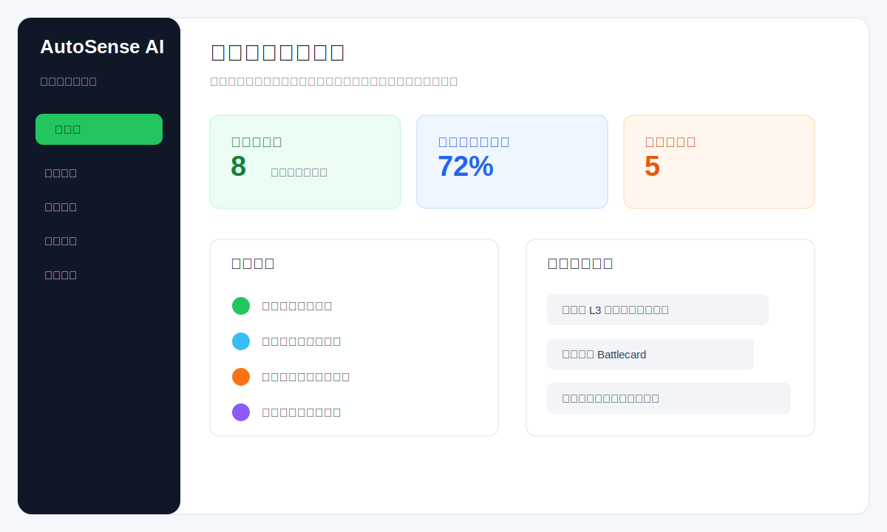
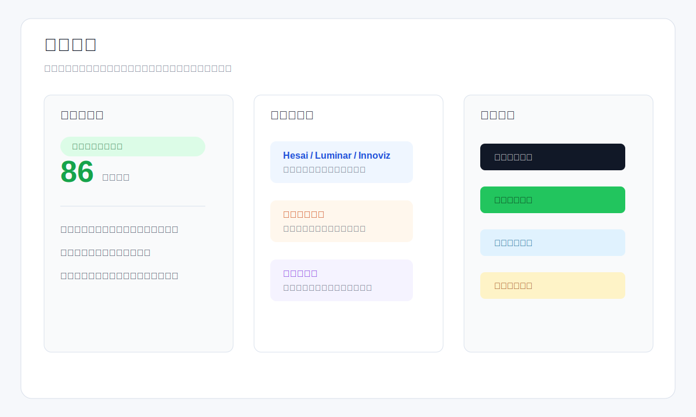
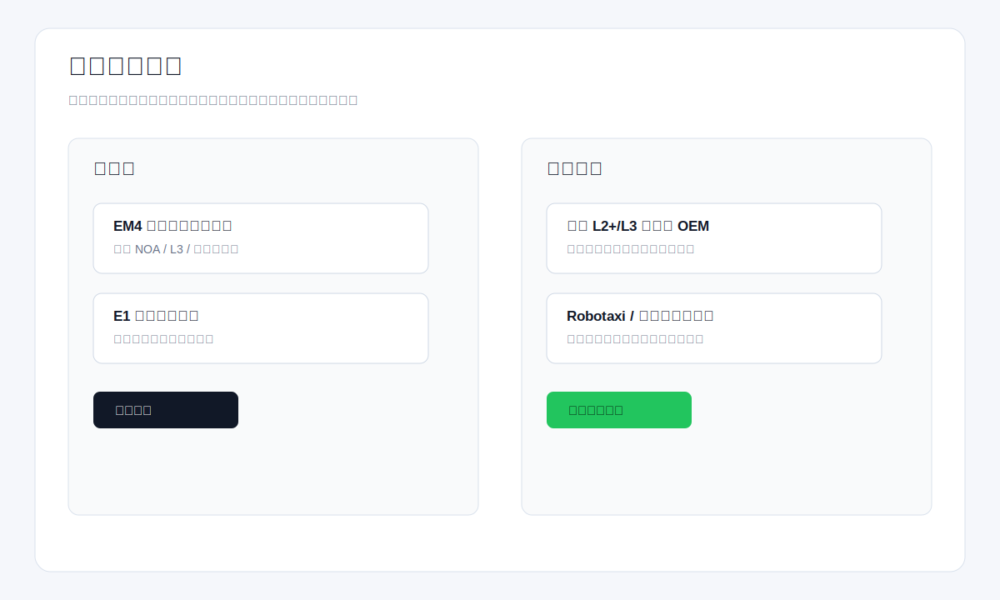

# AutoSense AI

面向车载激光雷达产品团队的 AI 产品决策工作台。系统把公开市场情报、竞品动态、客户需求字段、我方产品画像和资料依据库整合到一个动态 Web 应用中，帮助产品经理完成机会判断、需求拆解、竞品应对、产品方案生成和研发/售前协同。

GitHub: https://github.com/MwngxuZhang/autosense-ai

## 页面预览







## 动态体验方式

本项目不是静态页面。完整应用由 Python 后端、SQLite 数据库、前端工作台和 DeepSeek API 调用链组成。

### 本地运行

```powershell
cd outputs/autosense_ai_full
python server.py
```

打开：

```text
http://127.0.0.1:8765
```

### 云端部署

仓库已提供 Render/Railway/Fly.io 一类平台可用的动态部署文件：

- `requirements.txt`
- `Procfile`
- `render.yaml`

在 Render 上可以直接连接本仓库，使用 `render.yaml` 创建 Web Service。部署后访问平台生成的 URL 即可体验完整后端能力。

## API 配置

公开体验时不把 API Key 写入仓库。用户在页面 `API配置` 中填写自己的 DeepSeek Key：

- Key 只保存到当前浏览器 `localStorage`。
- 每次请求时临时带给后端调用模型。
- 服务端不会把体验者的 Key 写入仓库或公共配置文件。
- 没有 Key 时，系统会使用本地规则兜底，核心页面仍可运行。

本地开发者也可以复制 `outputs/autosense_ai_full/.env.example` 为 `.env`，配置服务端专用 Key。

## 核心模块

- 工作台：聚合核心流程、当前机会、推荐动作和系统状态。
- 市场雷达：抓取公开 RSS/搜索源，对市场信号做分类、摘要和机会评分。
- 决策中心：输出证据链结论、竞品威胁、客户字段缺口和下一步产品动作。
- 需求分析：把客户线索拆解为场景、指标、交付物、风险和待确认问题。
- 竞品对比：维护竞品技术路线、公开客户、威胁判断和 Battlecard。
- 产品方案：基于客户需求、我方产品线、竞品证据和资料依据库生成方案草案。
- 资料依据库：沉淀产品手册、测试说明、客户纪要和方案备忘录，用于降低 AI 幻觉风险。
- 产品画像：模块化维护产品线、目标客户、机会关键词和客户字段要求。
- 协同推进：将产品动作推送到 Jira、飞书、CRM、Slack 等外部工具。

## 简历材料

简历项目包装文档见：

```text
outputs/AutoSense_AI_产品经理简历项目包装.md
```

## 安全说明

真实 API Key 不要提交到 GitHub。仓库已通过 `.gitignore` 排除 `.env`、数据库文件、日志和缓存文件。
