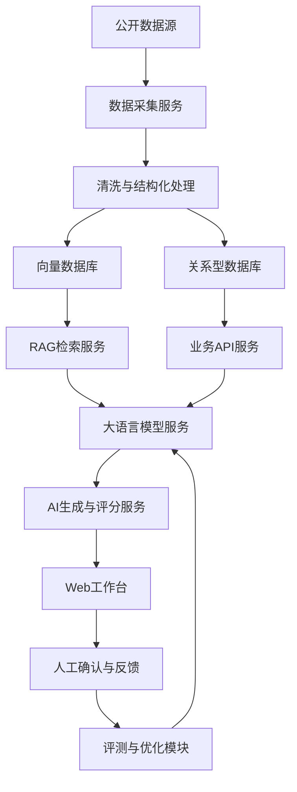

# AutoSense AI 技术文档

## 1. 文档目的

本文档用于描述 AutoSense AI 的产品技术方案，包括系统架构、核心模块、数据流、AI能力设计、评测体系、MVP实现路径和后续迭代规划。

本文档面向三类读者：

1. 产品经理：理解系统能力边界、功能逻辑和MVP范围。
2. 研发工程师：理解技术架构、模块划分和数据结构。
3. 项目评审者：判断项目是否具备真实业务价值和落地可行性。

## 2. 系统定位

AutoSense AI 是一个面向车载智驾传感器行业的B端AI工作台。系统通过采集公开行业信息、结构化竞品参数、解析客户需求，并结合大语言模型生成产品建议，帮助产品经理完成市场洞察、需求分析、产品定义、评估验收和售前材料准备。

系统核心链路：

市场情报采集 -> 信息清洗与结构化 -> AI分类摘要 -> 机会评分 -> 客户需求拆解 -> 竞品对比 -> 产品方案生成 -> 人工评审 -> AI评测与迭代

## 3. 总体架构

### 3.1 架构分层

系统可以分为六层：

| 层级 | 说明 |
|---|---|
| 数据源层 | 新闻源、RSS、企业官网、公告、法规网站、竞品资料、手动上传文档 |
| 数据处理层 | 抓取、去重、清洗、分段、实体抽取、参数抽取 |
| 知识存储层 | 资讯库、竞品库、需求库、向量库、评测数据集 |
| AI能力层 | 分类、摘要、问答、需求拆解、方案生成、评分解释 |
| 产品应用层 | 情报中心、竞品对比、需求分析、方案生成、评测中心 |
| 运营评估层 | 用户反馈、采纳率、幻觉率、任务耗时、A/B测试 |

### 3.2 架构图



## 4. 技术选型建议

### 4.1 MVP技术选型

如果作为轻量 MVP，建议采用低成本、可快速验证的实现方案：

| 模块 | 推荐技术 |
|---|---|
| 前端 | React + TypeScript + Vite |
| UI组件 | Ant Design 或 shadcn/ui |
| 后端 | Python FastAPI 或 Node.js NestJS |
| 数据库 | PostgreSQL 或 SQLite |
| 向量库 | Chroma、Qdrant 或 pgvector |
| 文档解析 | Python trafilatura、BeautifulSoup、pdfplumber |
| AI模型 | OpenAI API、通义千问、豆包、DeepSeek等 |
| 定时任务 | APScheduler、Celery Beat 或 GitHub Actions |
| 可视化 | ECharts、Recharts |
| 原型工具 | Figma、MasterGo、墨刀 |

### 4.2 作品集优先方案

如果时间有限，不建议一开始做完整工程。推荐按以下层级实现：

1. 第一阶段：Figma高保真原型 + 静态样例数据。
2. 第二阶段：React前端Demo + 本地JSON数据。
3. 第三阶段：加入后端API和AI接口。
4. 第四阶段：加入定时采集、向量库和评测看板。

## 5. 数据源设计

### 5.1 数据源类型

| 数据源 | 示例 | 采集方式 | 风险 |
|---|---|---|---|
| 行业新闻 | 汽车科技媒体、行业网站 | RSS、API、网页抓取 | 版权和更新频率 |
| 企业官网 | 激光雷达厂商官网 | 定时抓取 | 页面结构变化 |
| 公告和财报 | 上市公司公告 | 手动上传或公开接口 | 数据格式复杂 |
| 法规政策 | 欧盟、美国、中国监管网站 | 手动整理或定向抓取 | 解读需要谨慎 |
| 车企动态 | 新车发布、智驾平台信息 | 新闻源和官网 | 信息真实性 |
| 竞品资料 | 产品手册、官网参数 | 手动录入和文档解析 | 参数口径不统一 |
| 内部文档 | 客户纪要、售前材料 | 上传解析 | 权限和保密 |

### 5.2 MVP数据策略

MVP阶段建议不要宣称“全网实时抓取”。更可信的表达是：

“系统支持对公开来源进行定时采集和人工补充录入，在原型阶段使用结构化样例数据验证情报识别、需求拆解和方案生成逻辑。”

MVP数据集建议：

1. 30条行业资讯。
2. 10个竞品产品样本。
3. 20条客户需求样本。
4. 10条售前问答样本。
5. 10条验收场景样本。

## 6. 数据模型设计

### 6.1 MarketNews 行业资讯表

| 字段 | 类型 | 说明 |
|---|---|---|
| id | string | 资讯ID |
| title | string | 标题 |
| source | string | 来源 |
| source_url | string | 原文链接 |
| published_at | datetime | 发布时间 |
| fetched_at | datetime | 采集时间 |
| region | string | 地区 |
| category | string | 分类 |
| summary | text | AI摘要 |
| entities | json | 公司、车型、技术、地区等实体 |
| opportunity_score | number | 机会评分 |
| credibility_score | number | 来源可信度 |
| tags | array | 标签 |
| status | string | 待审核、已确认、已忽略 |

### 6.2 CompetitorProduct 竞品产品表

| 字段 | 类型 | 说明 |
|---|---|---|
| id | string | 产品ID |
| company | string | 厂商名称 |
| product_name | string | 产品型号 |
| technology_route | string | 技术路线 |
| wavelength | string | 波长 |
| detection_range | string | 探测距离 |
| fov_horizontal | string | 水平视场角 |
| fov_vertical | string | 垂直视场角 |
| point_rate | string | 点频 |
| frame_rate | string | 帧率 |
| power | string | 功耗 |
| ip_rating | string | 防护等级 |
| temperature_range | string | 工作温度 |
| mass_production_status | string | 量产状态 |
| public_customers | json | 公开客户 |
| source_url | string | 信息来源 |
| updated_at | datetime | 更新时间 |

### 6.3 CustomerRequirement 客户需求表

| 字段 | 类型 | 说明 |
|---|---|---|
| id | string | 需求ID |
| customer_name | string | 客户名称，可脱敏 |
| region | string | 地区 |
| raw_input | text | 原始需求文本 |
| scenario | string | 应用场景 |
| vehicle_level | string | 智驾等级或车型定位 |
| performance_requirements | json | 性能需求 |
| reliability_requirements | json | 可靠性需求 |
| compliance_requirements | json | 合规需求 |
| delivery_requirements | json | 交付需求 |
| priority | string | 优先级 |
| risk_points | json | 风险点 |
| confirmed_by_user | boolean | 是否人工确认 |
| created_at | datetime | 创建时间 |

### 6.4 ProductProposal 产品方案表

| 字段 | 类型 | 说明 |
|---|---|---|
| id | string | 方案ID |
| requirement_id | string | 关联客户需求 |
| product_positioning | text | 产品定位 |
| target_scenarios | json | 目标场景 |
| key_specs | json | 关键参数 |
| selling_points | json | 核心卖点 |
| development_tasks | json | 研发任务 |
| validation_metrics | json | 验收指标 |
| risks | json | 风险 |
| ai_generated_content | text | AI生成内容 |
| human_review_status | string | 审核状态 |
| created_at | datetime | 创建时间 |

### 6.5 AIEvaluation AI评测表

| 字段 | 类型 | 说明 |
|---|---|---|
| id | string | 评测ID |
| task_type | string | 任务类型 |
| input_id | string | 输入样本ID |
| model_name | string | 模型名称 |
| prompt_version | string | Prompt版本 |
| output | text | AI输出 |
| accuracy_score | number | 准确性评分 |
| coverage_score | number | 覆盖率评分 |
| traceability_score | number | 可追溯评分 |
| hallucination_flag | boolean | 是否存在幻觉 |
| adoption_status | string | 采纳、部分采纳、未采纳 |
| reviewer_comment | text | 人工评价 |
| created_at | datetime | 创建时间 |

## 7. 核心模块设计

### 7.1 市场情报模块

输入：

1. 新闻标题和正文。
2. 来源链接。
3. 发布时间。
4. 来源类型。

处理流程：

1. 去重：根据标题相似度和URL判断重复信息。
2. 清洗：去除广告、导航、无关文本。
3. 分类：判断资讯属于客户机会、竞品动态、技术趋势、政策法规或商业事件。
4. 摘要：生成100至200字摘要。
5. 实体识别：提取公司、车型、传感器类型、地区、时间、技术路线。
6. 机会评分：根据规则和AI解释生成评分。
7. 人工审核：产品经理确认是否加入情报库。

输出：

1. 情报卡片。
2. 机会评分。
3. 推荐关注动作。
4. 关联竞品或客户。

### 7.2 机会评分算法

MVP阶段可以采用规则评分加AI解释。

评分公式：

Opportunity Score = 0.25 * 市场相关度 + 0.20 * 客户相关度 + 0.20 * 产品影响度 + 0.15 * 时间紧迫度 + 0.10 * 来源可信度 + 0.10 * 商业转化可能性

各维度评分为0至100分。

示例：

| 维度 | 分数 | 原因 |
|---|---:|---|
| 市场相关度 | 90 | 信息与欧洲L3智驾高度相关 |
| 客户相关度 | 80 | 涉及目标车企平台 |
| 产品影响度 | 85 | 影响前向长距雷达定义 |
| 时间紧迫度 | 70 | 2027量产，当前需进入方案验证 |
| 来源可信度 | 75 | 来源为公开新闻，需二次确认 |
| 商业转化可能性 | 80 | 与供应链定点机会相关 |

### 7.3 客户需求拆解模块

Prompt设计原则：

1. 强制输出结构化JSON。
2. 区分事实、推断和待确认问题。
3. 对关键指标标记来源。
4. 不允许编造参数。
5. 对不确定项输出“待确认”。

输出结构示例：

```json
{
  "business_goal": "2027年量产L3车型",
  "application_scenarios": ["高速NOA", "拥堵自动驾驶"],
  "product_type": "前向长距激光雷达",
  "performance_requirements": {
    "detection_range": "待确认，客户表达为远距离探测",
    "frame_rate": "待确认",
    "fov": "待确认"
  },
  "reliability_requirements": ["车规可靠性", "低功耗"],
  "compliance_requirements": ["海外法规", "功能安全"],
  "deliverables": ["英文技术材料", "测试报告"],
  "risks": ["量产周期", "成本目标", "认证周期"],
  "questions_to_confirm": [
    "目标探测距离对应的反射率条件是什么？",
    "整车平台对功耗和安装空间的限制是多少？",
    "是否已有竞品供应商进入定点流程？"
  ]
}
```

### 7.4 竞品对比模块

功能：

1. 支持按厂商、型号、技术路线和场景筛选。
2. 支持参数表格对比。
3. 支持雷达图展示性能维度。
4. 支持差异化机会点生成。
5. 支持参数来源和更新时间追溯。

关键设计：

1. 参数必须保留来源链接。
2. 不同厂商参数口径不同，需要展示备注。
3. 对无法比较的参数标记“不适用”或“来源缺失”。
4. 不允许AI直接补全缺失硬件参数。

### 7.5 产品方案生成模块

生成流程：

1. 读取客户需求拆解结果。
2. 检索相关竞品数据。
3. 检索相关市场情报。
4. 根据产品定位模板生成方案。
5. 输出参数建议和依据。
6. 标记待研发确认项。
7. 生成风险清单。

输出内容：

1. 产品定位。
2. 目标客户和场景。
3. 关键规格建议。
4. 差异化卖点。
5. 研发需求列表。
6. 验收标准建议。
7. 售前沟通话术。
8. 需人工确认的问题。

## 8. RAG设计

### 8.1 为什么需要RAG

车载智驾产品信息变化快，且硬件参数必须准确。单纯依赖大模型记忆容易产生过期信息或幻觉。RAG可以让模型基于当前知识库检索结果进行回答，并提供来源。

### 8.2 RAG流程

1. 文档导入：新闻、产品手册、公告、客户纪要。
2. 文本切分：按标题、段落和表格切分。
3. 元数据标注：来源、时间、厂商、型号、地区、类型。
4. 向量化：生成embedding。
5. 检索：根据用户问题召回相关片段。
6. 重排序：优先选择来源可信、时间较新、与场景匹配的信息。
7. 生成：模型基于召回信息生成答案。
8. 引用：输出来源和不确定项。

### 8.3 检索策略

混合检索更适合本项目：

1. 关键词检索：适合产品型号、厂商名称、参数。
2. 向量检索：适合语义相似的需求和场景。
3. 元数据过滤：按时间、地区、厂商、信息类型过滤。

## 9. AI评测体系

### 9.1 评测任务类型

| 任务 | 评测重点 |
|---|---|
| 新闻摘要 | 是否准确、简洁、保留关键信息 |
| 新闻分类 | 分类是否正确 |
| 机会评分 | 分数是否合理，解释是否可理解 |
| 需求拆解 | 是否区分事实、推断和待确认 |
| 竞品参数抽取 | 参数是否正确，来源是否准确 |
| 产品方案生成 | 是否匹配场景，是否避免无依据承诺 |
| 售前材料生成 | 是否专业、清晰、适合客户沟通 |

### 9.2 指标定义

| 指标 | 计算方式 | 目标 |
|---|---|---|
| 分类准确率 | 正确分类样本数 / 总样本数 | MVP达到80%以上 |
| 需求拆解准确率 | 正确字段数 / 标准答案字段数 | MVP达到75%以上 |
| 覆盖率 | 输出覆盖必要维度数 / 必要维度总数 | MVP达到80%以上 |
| 来源可追溯率 | 有来源关键结论数 / 关键结论总数 | MVP达到90%以上 |
| 幻觉率 | 存在无依据关键结论样本数 / 总样本数 | MVP低于10% |
| 人工采纳率 | 被采纳输出数 / 总输出数 | MVP达到50%以上 |
| 平均节省时间 | 人工基准耗时 - 使用系统耗时 | 目标节省30%以上 |

### 9.3 人工评分表

每个AI输出由产品经理或领域专家按照5分制评分：

| 维度 | 1分 | 3分 | 5分 |
|---|---|---|---|
| 准确性 | 多处事实错误 | 基本正确但有遗漏 | 事实准确 |
| 完整性 | 缺少关键维度 | 覆盖主要维度 | 覆盖全面 |
| 可解释性 | 无依据 | 有部分依据 | 依据清晰 |
| 可执行性 | 无法落地 | 需要较多修改 | 可直接作为初稿 |
| 专业性 | 表达外行 | 基本专业 | 符合行业表达 |

## 10. 权限和合规设计

### 10.1 角色权限

| 角色 | 权限 |
|---|---|
| 管理员 | 用户管理、数据源配置、模型配置 |
| 产品经理 | 查看情报、创建需求、生成方案、确认AI输出 |
| 售前经理 | 查看方案、生成售前材料、导出文档 |
| 研发人员 | 查看需求和技术指标、反馈可行性 |
| 观察者 | 只读查看看板和报告 |

### 10.2 数据合规原则

1. 公开数据保留来源链接和采集时间。
2. 内部客户资料需要脱敏处理。
3. 对外材料必须经过人工审核。
4. AI输出不能直接作为正式报价和承诺。
5. 支持删除敏感文档和用户上传文件。

## 11. MVP页面设计

### 11.1 首页仪表盘

展示内容：

1. 今日新增情报数量。
2. 高机会评分事件。
3. 重点竞品动态。
4. 待确认客户需求。
5. AI输出质量指标。

### 11.2 市场情报页

核心组件：

1. 情报列表。
2. 分类筛选。
3. 机会评分。
4. 摘要卡片。
5. 关联客户和竞品。
6. 加入机会池按钮。

### 11.3 客户需求分析页

核心组件：

1. 原始需求输入框。
2. AI拆解结果。
3. 待确认问题。
4. 人工编辑和确认。
5. 生成产品方案按钮。

### 11.4 竞品对比页

核心组件：

1. 厂商和型号筛选。
2. 参数对比表。
3. 技术路线标签。
4. 雷达图。
5. 来源链接。
6. 差异化分析。

### 11.5 产品方案页

核心组件：

1. 产品定位。
2. 核心参数。
3. 功能优先级。
4. 研发任务。
5. 测试验收指标。
6. 风险清单。
7. 导出PRD按钮。

### 11.6 AI评测中心

核心组件：

1. 模型版本。
2. Prompt版本。
3. 分类准确率。
4. 幻觉率。
5. 采纳率。
6. 用户评分。
7. 失败案例分析。

## 12. 接口设计示例

### 12.1 创建客户需求

```http
POST /api/requirements
Content-Type: application/json
```

```json
{
  "customer_name": "匿名欧洲车企",
  "region": "Europe",
  "raw_input": "客户计划2027年量产L3车型，需要前向长距激光雷达..."
}
```

返回：

```json
{
  "requirement_id": "req_001",
  "status": "created"
}
```

### 12.2 AI拆解客户需求

```http
POST /api/ai/analyze-requirement
Content-Type: application/json
```

```json
{
  "requirement_id": "req_001",
  "prompt_version": "v0.1"
}
```

返回：

```json
{
  "requirement_id": "req_001",
  "analysis": {
    "business_goal": "2027年量产L3车型",
    "application_scenarios": ["高速NOA", "拥堵自动驾驶"],
    "risks": ["认证周期", "成本目标", "竞品定点"]
  },
  "questions_to_confirm": [
    "目标探测距离对应的反射率条件是什么？"
  ]
}
```

### 12.3 生成产品方案

```http
POST /api/ai/generate-proposal
Content-Type: application/json
```

```json
{
  "requirement_id": "req_001",
  "competitor_product_ids": ["cmp_001", "cmp_002"],
  "target_scenario": "L3 Highway"
}
```

返回：

```json
{
  "proposal_id": "prop_001",
  "positioning": "面向海外L2+/L3高阶智驾的前向长距激光雷达",
  "key_specs": {
    "detection_range": "建议定义为250m级别，需研发确认反射率条件",
    "fov_horizontal": "建议100度至120度"
  },
  "risks": [
    "低功耗要求可能影响探测性能",
    "2027量产需要提前完成车规验证"
  ]
}
```

## 13. 版本路线图

### V0.1 原型验证

目标：验证产品概念和核心流程。

功能：

1. 静态样例数据。
2. 情报看板。
3. 客户需求拆解。
4. 竞品对比。
5. 产品方案草案。

### V0.2 AI能力接入

目标：验证AI生成和评测能力。

功能：

1. 接入大模型API。
2. 结构化Prompt。
3. AI评测中心。
4. 人工反馈和采纳记录。

### V0.3 数据采集和RAG

目标：提高信息时效性和可追溯性。

功能：

1. 定时抓取公开资讯。
2. 文档上传解析。
3. 向量检索。
4. 来源引用。

### V1.0 团队协同版本

目标：支持真实B端团队协作。

功能：

1. 角色权限。
2. 产品路线图。
3. 需求变更管理。
4. 售前材料导出。
5. 与CRM、Jira或飞书集成。

## 14. 项目落地计划

### 第1周：调研与定义

1. 完成行业调研报告。
2. 完成用户画像和需求优先级。
3. 完成竞品字段模板。
4. 整理样例数据集。

### 第2周：PRD和原型

1. 输出PRD。
2. 绘制核心页面原型。
3. 设计用户流程。
4. 设计评测指标。

### 第3周：MVP Demo

1. 开发React前端。
2. 接入静态数据。
3. 实现情报、需求、竞品、方案四个页面。
4. 增加基础图表。

### 第4周：AI增强

1. 接入大模型API。
2. 实现需求拆解。
3. 实现方案生成。
4. 实现人工评分和评测看板。

## 15. 技术风险与应对

| 风险 | 说明 | 应对策略 |
|---|---|---|
| 抓取失败 | 网站结构变化或限制访问 | 使用RSS、API、手动导入作为备选 |
| AI幻觉 | 生成无依据参数 | RAG、来源引用、人工审核 |
| 参数口径不一 | 不同厂商定义不同 | 字段增加备注和测试条件 |
| 数据过少 | MVP样本不足 | 先人工构建小型高质量数据集 |
| 系统过重 | 功能范围过大 | 按V0.1至V1.0分阶段实现 |
| 合规风险 | 使用非授权数据 | 优先公开来源，只展示摘要和链接 |

