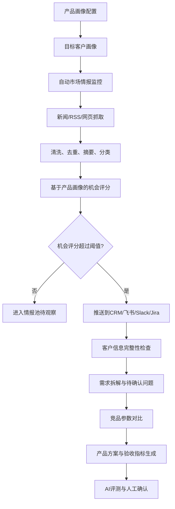

# AutoSense AI 真实运行版技术文档

## 1. 产品定位

AutoSense AI 是面向 RoboSense 速腾聚创车载智驾传感器产品团队的实时市场情报与产品决策系统。系统不是简单展示Demo，而是围绕“速腾产品能力 -> 市场机会监控 -> 客户需求识别 -> 竞品对比 -> 产品方案生成 -> 评测与推送”的闭环运行。

核心原则：

1. 先定义我方产品画像，再判断市场机会。
2. 市场信息应自动抓取、定时分析、按阈值推送。
3. 客户机会必须检查详细信息完整性。
4. AI输出必须保留来源、置信度、风险和人工确认入口。
5. API不可用时允许降级，但必须明确标记状态。

## 2. 真实业务流程



## 3. 核心模块

### 3.1 产品画像模块

系统必须先知道“我们是谁”，否则市场机会评分没有依据。

当前默认产品画像基于速腾聚创公开产品线：

| 产品 | 定位 | 适用场景 | 关键依据 |
|---|---|---|---|
| EM4 | 超高清长距数字化激光雷达 | L3、高阶智驾、Robotaxi | 2160-beam、600m最远测距、300m@10%测距、SPAD-SoC |
| EMX | 192线车载高性能数字化激光雷达 | L2/L2+、高阶ADAS、主激光雷达 | 192-beam、2.88M pts/s、20Hz、300m最远测距 |
| E1 | 全固态补盲激光雷达 | 城市NOA、泊车、侧向补盲 | 120°×90° FOV、30m@10%测距、25Hz级刷新 |
| M1 Plus | 车规级MEMS激光雷达 | 量产车型、NOA、前向感知 | 量产经验、车规级MEMS路线 |
| P6 | 感知系统方案 | 多传感器融合、高阶智驾方案 | 软硬结合、客户项目适配 |

产品画像字段：

| 字段 | 说明 |
|---|---|
| company_name | 公司或项目名称 |
| positioning | 我方产品定位 |
| core_products | 产品线，如前向长距雷达、补盲雷达 |
| target_scenarios | 高速NOA、城市NOA、L3、泊车等 |
| key_specs | 探测距离、FOV、功耗、车规可靠性等 |
| advantages | 差异化优势 |
| target_customers | 目标客户群体 |
| opportunity_keywords | 机会关键词 |
| exclusion_keywords | 排除关键词 |
| customer_required_fields | 客户信息完整性字段 |

客户详细信息要求包括：

1. 客户名称和地区。
2. 车型平台与量产时间。
3. 智驾等级与应用场景。
4. 目标传感器类型。
5. 关键性能指标。
6. 成本目标。
7. 可靠性和车规要求。
8. 合规和功能安全要求。
9. 竞品供应商状态。
10. 交付物要求。

### 3.2 自动市场情报监控

系统支持三类数据源：

| 数据源 | 当前实现 | 说明 |
|---|---|---|
| 搜索API | NewsAPI / Bing / SerpAPI | 配置Key后优先使用 |
| 公开RSS | Google News RSS / 用户配置RSS | 无付费Key时也能抓取公开新闻 |
| 重点网页 | 竞品官网、法规页面、行业网页 | 定向抓取并入库 |

主页不要求用户逐条输入网页。默认运行逻辑是读取监控主题，自动检索公开新闻源；只有在“市场情报”页中才允许维护后台检索主题、补充RSS和重点官网。

监控配置：

```json
{
  "enabled": true,
  "interval_minutes": 30,
  "queries": ["automotive lidar ADAS L3 Europe"],
  "rss_urls": [],
  "web_urls": [],
  "push_threshold": 80,
  "push_channels": ["crm"]
}
```

### 3.3 机会评分

评分由两部分组成：

1. 信息本身：是否涉及客户机会、竞品动态、政策法规、技术趋势。
2. 我方匹配：是否命中产品画像中的应用场景、客户群体、关键词和能力边界。

示例规则：

```text
基础分 = 新闻类别分 + 行业关键词分
产品匹配加分 = 命中我方机会关键词数量 * 4
排除项扣分 = 命中非目标领域关键词时扣分
最终分 = clamp(基础分 + 产品匹配加分 - 排除项扣分, 0, 98)
```

### 3.4 客户需求分析

客户需求不应只是一段文本，也不应只能手工录入。真实流程是：

1. 高机会新闻进入机会池。
2. 系统基于速腾产品画像判断匹配产品。
3. 系统检查客户字段完整性。
4. 字段缺失时生成待确认问题。
5. 信息足够时进入产品方案生成。

需求拆解结构：

| 类别 | 示例 |
|---|---|
| 业务目标 | 2027年量产L3车型 |
| 应用场景 | 高速NOA、拥堵自动驾驶 |
| 产品类型 | 前向长距激光雷达 |
| 性能需求 | 探测距离、FOV、帧率、功耗 |
| 可靠性要求 | IP67/IP6K9K、温度、振动、寿命 |
| 合规要求 | 海外法规、功能安全、车规认证 |
| 交付物 | 英文材料、测试报告、技术方案 |
| 风险 | 量产周期、认证周期、竞品定点、成本目标 |
| 待确认问题 | 反射率条件、安装空间、预算、竞品状态 |

### 3.5 DeepSeek API

系统支持OpenAI兼容接口形式调用DeepSeek。

推荐配置：

```text
LLM_PROVIDER=deepseek
DEEPSEEK_API_KEY=你的Key
DEEPSEEK_BASE_URL=https://api.deepseek.com
DEEPSEEK_MODEL=deepseek-v4-flash
```

说明：

1. 页面“API配置”可直接填写Key。
2. `/api/ai/test` 用于连接诊断。
3. 如果API不可用，系统降级为本地规则，但页面应显示Mock状态。
4. 不要将 `.env` 上传到GitHub。
5. 系统只接受 `sk-` 开头的DeepSeek Key，防止浏览器自动填充污染Key。

### 3.6 产品方案生成依据

产品方案必须同时依赖四类输入：

| 输入 | 作用 |
|---|---|
| 速腾产品画像 | 决定可推荐EM4、EMX、E1、M1 Plus或P6 |
| 客户需求拆解 | 决定目标场景、性能、成本、车规、交付物 |
| 实时市场与竞品动态 | 判断竞争威胁、价格趋势、客户定点状态 |
| AI评测与人工确认 | 控制幻觉、追溯来源、标记待确认参数 |

禁止仅根据新闻标题直接生成对外承诺型参数；所有参数都应标记为“已知事实、建议、待确认”。

## 4. 当前接口

### 4.1 配置与健康检查

```text
GET  /api/health
GET  /api/config
POST /api/config
POST /api/ai/test
```

### 4.2 产品画像

```text
GET  /api/product-profile
POST /api/product-profile
```

### 4.3 市场监控

```text
GET  /api/monitor
POST /api/monitor/config
POST /api/monitor/run
POST /api/monitor/start
POST /api/monitor/stop
```

### 4.3.1 机会池与竞品动态

```text
GET  /api/opportunities
POST /api/opportunities/analyze
POST /api/competitors/realtime
```

### 4.4 情报、需求、方案

```text
GET  /api/news
GET  /api/competitors
GET  /api/requirements
POST /api/requirements
GET  /api/proposals
POST /api/proposals
POST /api/auto/analyze
```

### 4.5 RAG与评测

```text
POST /api/documents
GET  /api/documents
POST /api/rag/query
GET  /api/evaluations
POST /api/evaluations
```

### 4.6 外部推送

```text
POST /api/integrations/send
```

## 5. 数据存储

当前使用SQLite，适合本地运行和小团队原型。生产环境建议迁移到PostgreSQL。

核心表：

| 表 | 用途 |
|---|---|
| market_news | 市场情报 |
| competitors | 竞品参数 |
| requirements | 客户需求 |
| proposals | 产品方案 |
| documents | 知识库文档 |
| evaluations | AI评测 |
| integrations | 推送记录 |

文件配置：

| 文件 | 用途 |
|---|---|
| `.env` | API Key和Webhook |
| `monitor_config.json` | 监控配置 |
| `product_profile.json` | 产品画像和客户信息要求 |
| `autosense.db` | SQLite数据库 |

## 6. 自动抓取运行逻辑

1. 定时器读取 `monitor_config.json`。
2. 对每个关键词执行搜索。
3. 如果配置了NewsAPI/Bing/SerpAPI，优先使用商业搜索API。
4. 如果没有商业搜索API，使用Google News RSS作为公开新闻源。
5. 抓取RSS源和重点网页。
6. 清洗文本、抽取实体、分类。
7. 读取 `product_profile.json`，判断是否命中我方产品和目标客户。
8. 计算机会评分。
9. 入库。
10. 高于阈值的情报写入推送记录，并通过Webhook发送。

## 7. 为什么之前“配置API后仍像没自动分析”

原因分为三类：

1. DeepSeek API已经连通，但市场抓取默认没有新闻API，因此之前只能走Mock搜索。
2. 系统缺少产品画像，无法判断哪些新闻是“我们的机会”。
3. 客户信息要求没有结构化，导致机会无法继续进入真实产品流程。

现在已补齐：

1. 无新闻API时使用公开RSS。
2. 新增产品画像和目标客户画像。
3. 新增客户详细信息字段要求。
4. 监控评分会结合我方产品关键词。
5. 产品方案生成会读取我方产品画像。

## 8. 生产化建议

如果要做成真正上线产品，下一步建议：

1. 数据库迁移到PostgreSQL。
2. 定时任务迁移到Celery Beat、APScheduler或云函数。
3. RAG迁移到pgvector、Qdrant或Milvus。
4. 增加去重算法，避免同一新闻多次入库。
5. 增加来源可信度白名单。
6. 增加客户机会池和销售阶段管理。
7. 增加权限系统，区分产品、售前、研发、管理层。
8. 增加正式推送渠道：飞书机器人、Slack、Jira、Linear、CRM。
9. 增加模型调用日志、Token成本和失败重试。
10. 增加人工确认流，关键参数未经确认不得对外承诺。

## 9. 当前运行方式

```powershell
cd C:\Users\ADMIN\Documents\Codex\2026-07-02\new-chat\outputs\autosense_ai_full
python server.py
```

访问：

```text
http://127.0.0.1:8765
```
