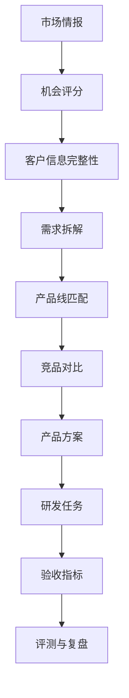

# AutoSense AI 类比竞品调研报告

## 1. 调研目的

本报告用于分析市面上与 AutoSense AI 类似或相邻的产品。它们不一定服务车载激光雷达行业，但在“市场情报监控、竞品分析、AI摘要、客户反馈、产品决策、推送协同”等方面具有可借鉴价值。

AutoSense AI 当前定位：

> 面向 RoboSense 速腾聚创车载智驾传感器产品团队的实时市场情报与产品决策系统，帮助产品经理从公开市场信息、竞品动态和客户线索中识别机会，并转化为需求拆解、产品方案、风险评估和后续协同动作。

本报告重点回答：

1. 市面上类似平台有哪些？
2. 它们和 AutoSense AI 有什么不同？
3. 哪些设计、能力和工作流值得借鉴？
4. AutoSense AI 下一步应该优先补什么？

## 2. 类比产品选择

本次选择 10 类代表性产品：

| 类型 | 产品 | 选择原因 |
|---|---|---|
| AI市场情报 | AlphaSense | 强AI搜索、研究报告、可引用答案 |
| 科技市场情报 | CB Insights | 市场地图、公司库、技术趋势、API数据 |
| AI信息流/情报订阅 | Feedly Market Intelligence | 自动追踪主题、AI Feeds、Newsletter |
| 竞品情报 | Crayon | 自动监控竞品变化、实时提醒、销售赋能 |
| 竞争赋能 | Klue | Battlecard、Win/Loss、销售场景交付 |
| 媒体/舆情智能 | Meltwater | 媒体、社交、AI信号整合与报告 |
| 实时风险情报 | Dataminr | 大规模公共数据源、实时事件预警 |
| 数字竞争分析 | Similarweb | 网站流量、市场份额、竞品Benchmark |
| 产品反馈/发现 | Productboard | 客户反馈到需求、优先级和路线图 |
| 产品路线图 | Aha! | 战略、需求、路线图、研发协同 |

## 3. 横向对比

| 产品 | 核心价值 | 主要数据源 | AI能力 | 输出形式 | 对 AutoSense AI 的启发 |
|---|---|---|---|---|---|
| AlphaSense | 快速研究市场、公司和行业 | 研报、公告、电话会、新闻、内部文档 | AI搜索、生成式答案、深度研究 | 可引用答案、报告、研究摘要 | 强化“有来源的结论”和深度研究报告 |
| CB Insights | 科技趋势和公司情报 | 创投、初创公司、专利、合作、新闻 | 趋势识别、数据增强 | 市场地图、公司画像、Scouting Report | 引入市场地图、供应商评分卡 |
| Feedly | 持续追踪主题和趋势 | 新闻、博客、网页、RSS | AI Feeds、主题识别、AI Actions | Feed、报告、Newsletter | 增加可配置主题、周报/月报生成 |
| Crayon | 竞品监控与销售作战 | 官网、新闻、社媒、招聘、评论、App Store等 | 自动筛选竞品变化 | 竞品提醒、Battlecard | 强化竞品动态到销售/售前动作 |
| Klue | 竞争情报落地到销售 | 外部资料、内部销售反馈、Win/Loss | 评论分析、强弱项生成 | Battlecard、销售话术、Win/Loss洞察 | 增加客户定点场景的作战卡片 |
| Meltwater | 媒体与品牌舆情智能 | 全球媒体、社媒、AI搜索信号 | AI助手、媒体摘要、叙事分析 | Brief、报告、舆情看板 | 增加品牌/竞品声量和叙事监控 |
| Dataminr | 实时事件和风险预警 | 大规模公共数据源，多模态信号 | 事件检测、风险上下文 | 实时Alert、风险说明 | 引入高优先级事件实时预警机制 |
| Similarweb | 数字市场与竞品流量分析 | 网站/App流量、搜索、渠道数据 | 市场趋势分析 | Benchmark、趋势图、流量报告 | 增加竞品官网流量/关注度指标 |
| Productboard | 客户反馈转产品决策 | 客户反馈、销售、支持、访谈 | 自动归类反馈、趋势识别 | Feature、Insight、优先级 | 强化客户需求池和优先级管理 |
| Aha! | 产品战略与路线图管理 | Idea、需求、目标、研发任务 | AI助手、需求/故事生成 | Roadmap、Release、Feature | 增加路线图和研发交付视图 |

## 4. 重点竞品分析

### 4.1 AlphaSense：AI市场研究平台

AlphaSense 的核心优势是将大规模外部内容和企业内部知识结合，用户可以用自然语言检索市场、公司、主题，并获得带引用的答案。其公开资料强调覆盖数亿级文档，并提供生成式搜索、Generative Grid、Deep Research 等能力。

值得学习：

1. **结论必须带来源**  
   AutoSense AI 当前已经有 source_url，但还需要把每条AI结论拆成“事实、推断、待确认、来源”。

2. **从问答升级到研究报告**  
   不只是回答“这条新闻是什么意思”，而是生成“欧洲L3激光雷达机会报告”“Hesai对速腾的威胁分析”等完整报告。

3. **内部知识和外部情报融合**  
   后续应允许上传速腾内部产品手册、测试报告、客户纪要，再结合公开新闻做判断。

对 AutoSense AI 的启发：

> 建立“引用型AI结论”机制：每个推荐动作必须能追溯到新闻、产品画像、竞品参数或客户需求字段。

### 4.2 CB Insights：科技市场情报和趋势平台

CB Insights 更强调结构化市场数据、公司库、投资、专利、合作、新闻和趋势。它适合战略、投资、创新团队判断行业方向、供应商格局和技术路线。

值得学习：

1. **市场地图**  
   AutoSense AI 可增加“激光雷达厂商地图”，按长距主雷达、补盲雷达、FMCW、1550nm、905nm、全固态等维度组织。

2. **供应商评分卡**  
   对 Hesai、Luminar、Innoviz、Aeva、Valeo、Ouster、Seyond 等竞品建立评分。

3. **趋势图表**  
   监控关键词热度、定点事件数量、价格变化、融资/财报信号。

对 AutoSense AI 的启发：

> 从“新闻列表”升级为“行业结构图 + 供应商评分卡 + 趋势仪表盘”。

### 4.3 Feedly Market Intelligence：AI信息流和主题追踪

Feedly 的优势是轻量、持续、可配置。它用AI Feeds追踪公司、趋势、技术主题，帮助研究人员从大量文章中筛选重要内容。

值得学习：

1. **主题配置应该产品化**  
   AutoSense AI 当前有监控主题配置，但可以进一步产品化为“机会主题包”，例如：
   - 海外L3定点机会
   - 补盲雷达降本趋势
   - 竞品价格战
   - Robotaxi长距雷达需求

2. **情报简报自动生成**  
   支持每日/每周自动生成“智驾传感器市场简报”。

3. **AI Actions**  
   用户选中多条资讯后，生成总结、对比、报告或行动建议。

对 AutoSense AI 的启发：

> 增加“主题包 + 情报简报 + 多资讯合成分析”。

### 4.4 Crayon：竞品监控和销售赋能

Crayon 的定位更接近竞品情报系统。它强调自动监控竞争对手，提醒相关变化，并把情报转化为销售团队可用的内容。

值得学习：

1. **竞品变化类型细分**
   - 新产品发布
   - 客户定点
   - 价格变化
   - 招聘变化
   - 官网文案变化
   - 客户案例变化

2. **情报到行动**
   不是只展示“发生了什么”，而是提示：
   - 是否影响某条产品线？
   - 是否需要更新售前材料？
   - 是否需要销售跟进客户？

3. **Battlecard**
   对每个竞品生成销售/售前作战卡。

对 AutoSense AI 的启发：

> 增加“竞品作战卡”：Hesai vs RoboSense、Luminar vs EM4、Innoviz vs EMX、Aeva 4D LiDAR vs EM4。

### 4.5 Klue：竞争赋能和Win/Loss分析

Klue 的重点不是单纯监控，而是把竞争情报送到销售和客户场景中。它强调 battlecards、Win/Loss 访谈、客户关心的强弱项。

值得学习：

1. **从产品视角转向客户决策视角**  
   客户不是只看参数，还看：
   - 量产风险
   - 供应链稳定性
   - 成本
   - 技术支持
   - 认证
   - 过往项目经验

2. **Win/Loss机制**  
   每次客户定点成功/失败都沉淀原因。

3. **销售场景交付**  
   情报直接生成售前问答、竞品反驳点、客户沟通材料。

对 AutoSense AI 的启发：

> 增加“定点复盘库”和“客户决策因素库”，让系统越用越懂真实客户。

### 4.6 Meltwater：媒体、社媒和品牌叙事监控

Meltwater 处理的是媒体、社交、品牌声量和舆情。它的AI助手 Mira 能帮助用户理解媒体覆盖、叙事变化和行动建议。

值得学习：

1. **声量与叙事监控**
   对速腾、禾赛、Luminar、Innoviz 等厂商监控：
   - 媒体声量
   - 正负面情绪
   - 核心叙事
   - 技术关键词

2. **高层报告**
   自动生成管理层可读的月度市场简报。

3. **媒体影响分析**
   某个事件是否只是新闻热度，还是会影响客户判断？

对 AutoSense AI 的启发：

> 增加“品牌/竞品叙事看板”，判断市场认知如何变化。

### 4.7 Dataminr：实时事件和风险预警

Dataminr 的强项是大规模公共数据源和实时风险预警。它面向安全、风险、政府、企业运营等场景，强调“越早发现越有价值”。

值得学习：

1. **实时告警优先级**
   AutoSense AI 可将事件分为：
   - P0：重大客户定点、竞品破产、法规突变
   - P1：竞品发布、价格变化、供应链事件
   - P2：行业报告、观点文章、一般新闻

2. **事件生命周期**
   从初始信号、确认、影响评估、行动、关闭。

3. **风险而非资讯**
   对产品经理来说，重要的是“影响产品路线图的风险”。

对 AutoSense AI 的启发：

> 把“高机会池”升级为“机会/风险事件中心”，带状态流转。

### 4.8 Similarweb：数字市场和竞品流量分析

Similarweb 主要做网站/App流量、渠道、市场份额、数字竞争分析。它不是产品情报工具，但它的Benchmark思路值得借鉴。

值得学习：

1. **Benchmark视角**
   对比不同竞品在市场上的关注度和增长趋势。

2. **可视化强**
   趋势图、对比图、份额图非常适合管理层理解。

3. **指标标准化**
   把复杂信号转成可比较指标。

对 AutoSense AI 的启发：

> 增加“竞品关注度/事件趋势图”，让情报不仅是文本，也能形成趋势判断。

### 4.9 Productboard：客户反馈到产品决策

Productboard 的核心是把客户反馈集中管理，识别趋势，并关联到功能需求和路线图。

值得学习：

1. **客户反馈统一入口**
   AutoSense AI 应支持销售纪要、客户访谈、邮件、Slack/飞书消息、售前问答进入需求池。

2. **需求和功能关联**
   客户说“需要L3长距感知”，系统应关联到 EM4、EMX、P6 等产品能力。

3. **优先级机制**
   需求不只是记录，还要评分：影响客户数、商业价值、开发成本、战略匹配度。

对 AutoSense AI 的启发：

> 建立“客户需求池 + 产品能力映射 + 优先级评分”。

### 4.10 Aha!：产品路线图和研发协同

Aha! 更偏产品战略、需求、路线图、研发协同。它适合把想法变成路线图和发布计划。

值得学习：

1. **路线图视图**
   AutoSense AI 需要从“方案建议”继续走到：
   - 产品路线图
   - 版本计划
   - 研发任务
   - 测试验收

2. **从客户价值到开发计划**
   每个产品方案都应关联客户价值和研发投入。

3. **研发同步**
   和 Jira/Linear/飞书项目等工具同步状态。

对 AutoSense AI 的启发：

> 增加“方案 -> Roadmap -> 研发任务 -> 验收指标”的闭环。

## 5. AutoSense AI 与竞品的差异化

### 5.1 我们不做泛行业情报，而做垂直产品决策

AlphaSense、CB Insights、Feedly 更偏泛行业研究。AutoSense AI 的差异化应是：

> 面向车载智驾传感器产品经理，把市场情报直接转成客户需求、产品方案、验收指标和售前动作。

### 5.2 我们不只监控竞品，而是判断对速腾产品线的影响

Crayon、Klue 更偏竞品销售赋能。AutoSense AI 应进一步结合速腾产品画像：

- EM4 是否适合承接长距L3机会？
- E1 是否适合补盲/泊车机会？
- EMX 是否适合作为主雷达量产方案？
- P6 是否适合系统级客户？

### 5.3 我们不只做AI摘要，而是做客户信息完整性检查

大多数情报工具告诉用户“发生了什么”。AutoSense AI 应告诉用户：

- 这个机会缺哪些客户信息？
- 需要问客户什么问题？
- 是否能进入产品方案评审？
- 推荐哪条产品线？
- 有哪些风险？

### 5.4 我们应该形成产品经理闭环

理想闭环：

## 6. 值得借鉴的功能清单

### P0：必须优先补齐

| 功能 | 来源借鉴 | 价值 |
|---|---|---|
| 引用型AI结论 | AlphaSense | 增强可信度，避免幻觉 |
| 高机会事件中心 | Dataminr | 从新闻列表升级为事件流 |
| 客户信息完整性检查 | Productboard/Klue | 让需求拆解更可执行 |
| 竞品作战卡 | Crayon/Klue | 支持售前和客户定点 |
| 产品线匹配 | 垂直化差异点 | 体现速腾业务价值 |

### P1：增强产品专业度

| 功能 | 来源借鉴 | 价值 |
|---|---|---|
| 市场地图 | CB Insights | 结构化展示行业格局 |
| 情报周报/月报 | Feedly/Meltwater | 降低汇报成本 |
| Win/Loss复盘 | Klue | 沉淀真实客户决策原因 |
| 竞品趋势图 | Similarweb | 提供管理层可读视角 |
| Roadmap视图 | Aha! | 从方案进入研发计划 |

### P2：进一步生产化

| 功能 | 来源借鉴 | 价值 |
|---|---|---|
| 内部知识库融合 | AlphaSense | 结合产品手册、测试报告、客户纪要 |
| 多源告警 | Dataminr/Meltwater | 更快发现风险 |
| CRM/Jira/飞书深度集成 | CB Insights/Aha!/Klue | 进入企业协同流 |
| 角色权限和审计 | Productboard/Aha! | 支持真实团队使用 |
| 供应商评分卡 | CB Insights | 支持战略和采购判断 |

## 7. 对当前 AutoSense AI 的具体改进建议

### 7.1 首页

当前首页已经有自动市场机会雷达。建议进一步改成：

1. 今日新机会
2. 高风险竞品动态
3. 待补齐客户字段
4. 待评审产品方案
5. DeepSeek调用状态
6. 本周趋势摘要

### 7.2 市场情报页

建议增加：

1. 情报来源过滤：公开RSS、新闻API、官网、客户纪要。
2. 事件状态：待审核、已确认、已忽略、已转需求。
3. 事实/推断/建议动作分栏。
4. 选中多条情报生成报告。

### 7.3 需求分析页

建议增加：

1. 客户字段完整性雷达图。
2. 缺失字段一键生成客户追问清单。
3. 客户需求优先级评分。
4. 需求与产品线自动关联。

### 7.4 竞品对比页

建议增加：

1. 竞品作战卡。
2. 参数差异表。
3. 定点客户对比。
4. 竞品风险等级。
5. “如何回应客户质疑”的售前话术。

### 7.5 产品方案页

建议增加：

1. 方案版本管理。
2. 研发任务拆解。
3. 验收指标表。
4. 风险矩阵。
5. 导出PRD/售前方案。

## 8. 结论

市面上的成熟产品大多在某一个方向做得很强：

- AlphaSense 强在 AI研究和引用型答案。
- CB Insights 强在结构化科技市场数据。
- Feedly 强在持续主题追踪。
- Crayon/Klue 强在竞品情报到销售动作。
- Meltwater/Dataminr 强在实时媒体和风险预警。
- Productboard/Aha! 强在客户需求和产品路线图。

AutoSense AI 的机会不是复制它们，而是将这些能力垂直整合到车载智驾传感器产品经理的真实工作流中：

> 从市场机会发现，到客户信息完整性，到需求拆解，到速腾产品线匹配，到竞品对比，到产品方案和验收指标。

如果继续完善，AutoSense AI 最应该成为一个“垂直行业产品决策工作台”，而不是普通市场情报工具。

## 9. 参考来源

1. AlphaSense 官方网站：https://www.alpha-sense.com/
2. AlphaSense Market Intelligence Platform：https://www.alpha-sense.com/solutions/market-intelligence-platform/
3. CB Insights Research：https://www.cbinsights.com/research/
4. Crayon 官方网站：https://www.crayon.co/
5. Klue 官方网站：https://klue.com/
6. Feedly AI：https://feedly.com/ai
7. Feedly Market Intelligence：https://feedly.com/new-features/posts/meet-feedly-ai-for-market-intelligence
8. Meltwater 官方网站：https://www.meltwater.com/en
9. Dataminr 官方网站：https://www.dataminr.com/
10. Similarweb 官方网站：https://www.similarweb.com/
11. Productboard 官方网站：https://www.productboard.com/
12. Productboard Platform：https://www.productboard.com/platform/
13. Aha! 官方网站：https://www.aha.io/
14. Aha! Roadmaps：https://www.aha.io/roadmaps/overview

